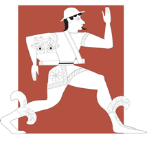
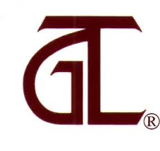
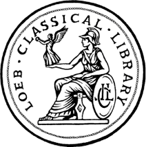

Estes são alguns dos principais projetos voltados para a produção de edições digitais de textos em língua grega com algumas considerações sobre os propósitos almejados por cada projeto.

<table width="100%" cellspacing="0" cellpadding="0" style="width: 100%; border-collapse: collapse">
  <tbody>
    <tr>
      <td valign="middle" style="width: 33%">
        
<a href="https://scaife.perseus.org"><b>Perseus Digital Library</b></a>

      </td>
      <td valign="middle" style="width: 33%">
        
<a href="http://www.tlg.uci.edu"><b>Thesaurus Linguæ Græcæ</b></a>

      </td>
      <td valign="middle" style="width: 33%">
        
<a href="https://www.loebclassics.com"><b>Digital Loeb Classical Library</b></a>

      </td>
    </tr>
    <tr>
      <td valign="middle" style="width: 33%">
        
<a href="https://creativecommons.org/licenses/by-sa/4.0/deed.pt_BR">CC-BY-SA-4.0 License</a>

      </td>
      <td valign="middle" style="width: 33%">
        
<a href="http://stephanus.tlg.uci.edu/copyright.php">Protegido por direitos autorais</a>

      </td>
      <td valign="middle" style="width: 33%">
        
<a href="https://www.loebclassics.com/page/terms">Protegido por direitos autorais</a>

      </td>
    </tr>
    <tr>
      <td valign="middle" style="width: 33%">
        
Acesso livre

      </td>
      <td valign="middle" style="width: 33%">
        
Acesso livre a parte do corpus; acesso ao corpus completo custa <a href="https://stephanus.tlg.uci.edu/indivaccounts/signup">US$140/ano</a>

      </td>
      <td valign="middle" style="width: 33%">
        
<a href="https://www.loebclassics.com/page/subscribe;jsessionid=14A54CCD4EC90636D4BDFC93FD7DAAF3#pageContent:~:text=at%20%24170%20for%20the%20first%20year%20and%20%2470%20for%20subsequent%20consecutive%20years">US$ 170 (primeiro ano); US$ 70 (anos subsequentes consecutivos)</a>

      </td>
    </tr>
    <tr>
      <td valign="middle" style="width: 33%">
        
Tufts Uni &amp; Uni Leipzig

      </td>
      <td valign="middle" style="width: 33%">
        
UCLA

      </td>
      <td valign="middle" style="width: 33%">
        
Harvard University

      </td>
    </tr>
    <tr>
      <td valign="middle" style="width: 33%">
        
<a href="http://www.perseus.tufts.edu/hopper/about/who/gregoryCrane?redirect=true">Gregory Crane</a>

      </td>
      <td valign="middle" style="width: 33%">
        
<a href="http://stephanus.tlg.uci.edu/team.php">Maria Pantelia</a>

      </td>
      <td valign="middle" style="width: 33%">
        
<a href="https://www.hup.harvard.edu/features/loeb/editor.html">Jeffrey Henderson</a>

      </td>
    </tr>
    <tr>
      <td valign="middle" style="width: 33%">
        
1985

      </td>
      <td valign="middle" style="width: 33%">
        
1972

      </td>
      <td valign="middle" style="width: 33%">
        
2012

      </td>
    </tr>
    <tr>
      <td valign="middle" style="width: 33%">
        
Aparato crítico previsto

      </td>
      <td valign="middle" style="width: 33%">
        
Sem planos

      </td>
      <td valign="middle" style="width: 33%">
        
Aparato crítico mínimo

      </td>
    </tr>
    <tr>
      <td valign="middle" style="width: 33%">
        

      </td>
      <td valign="middle" style="width: 33%">
        

      </td>
      <td valign="middle" style="width: 33%">
        

      </td>
    </tr>
  </tbody>
</table>

## Digital LOEB Classical Library

A LOEB nasceu com a proposta de oferecer uma edição razoável do texto grego acompanhado por uma tradução — propositalmente prolixa em alguns casos — que deve servir de auxílio para a compreensão do grego em um tamanho portátil e por um preço acessível. Quando foi feita a digitalização da coleção, os editores optaram por manter o mesmo formato do livro físico no ambiente de leitura virtual.

## Thesaurus Linguæ Græcæ

O TLG é projeto mais antigo do grupo e certamente o mais conhecido. O propósito do projeto é disponibilizar ao menos uma edição de cada texto grego da antiguidade até a modernidade, sem a preocupação de incorporar o aparato crítico ou dar conta das diferenças entre os manuscritos utilizados no estabelecimento do texto da obra. Sobre o TLG, é importante observar que as edições que a maior parte dos usuários do Diogenes encontra é aquela utilizada pelo projeto nos anos 90, com os textos transcritos das edições críticas de referência em um formato chamado Betacode. Atualmente, o material completo produzido pelo projeto pode ser acessado online, sendo que o acesso a uma parte do cânone é gratuito. Segundo uma entrevista recente com a diretora do projeto, em breve todo o cânone estaria disponível para livre acesso.

## Perseus, Open Greek and Latin, First1kGreek, First2kGreek e First3kGreek

O projeto [Open Greek and Latin](https://www.opengreekandlatin.org) (que inclui o [First1kGreek](https://opengreekandlatin.github.io/First1KGreek/), o First2kGreek e o First3kGreek) é atualmente a nossa principal referência, e o primeiro a incorporar valores e métodos de trabalho próprios ao meio digital do terceiro milênio, por ter o propósito de produzir edições de código aberto para livre acesso dos três mil anos da língua grega. Na prática, isso significa que todas as edições produzidas pelo projeto [ficam disponíveis para serem baixadas](https://github.com/OpenGreekAndLatin/First1KGreek) e utilizadas em projetos de qualquer natureza, sem a necessidade de obter qualquer tipo de autorização especial[^2].

Um dos projetos alimentados por essas edições é o [Scaife Viewer](https://scaife.perseus.org), um novo ambiente virtual de leitura, ainda em desenvolvimento, do Perseus Digital Library, que incluirá:

1. todos os textos de fonte primária do projeto OPGL;
2. as tradicionais ferramentas lexicais e de análise morfológica, incluindo uma melhor integração com o [Alpheios](https://alpheios.net);
3. produções de outros projetos utilizando os insumos do OPGL, como, por exemplo:
	- [traduções alinhadas](http://ugarit.ialigner.com);
	- [representações visuais em forma de árvore das dependências morfossintáticas](https://perseids-publications.github.io/gorman-trees/);
	- [comentários filosóficos/filológicos de especialistas publicados via New Alexandria](https://newalexandria.info);
	- imagens do manuscritos das obras.

Para experimentar o Scaife com todos os recursos, **recomendo fortemente visitar [este protótipo](https://sv-mini.scaife-viewer.org/)**.

[^2]: Para conhecer os detalhes da licença utilizada, visite o site da <a href="https://creativecommons.org/licenses/by-sa/4.0/deed.pt_BR">creativecommons.org</a>.
