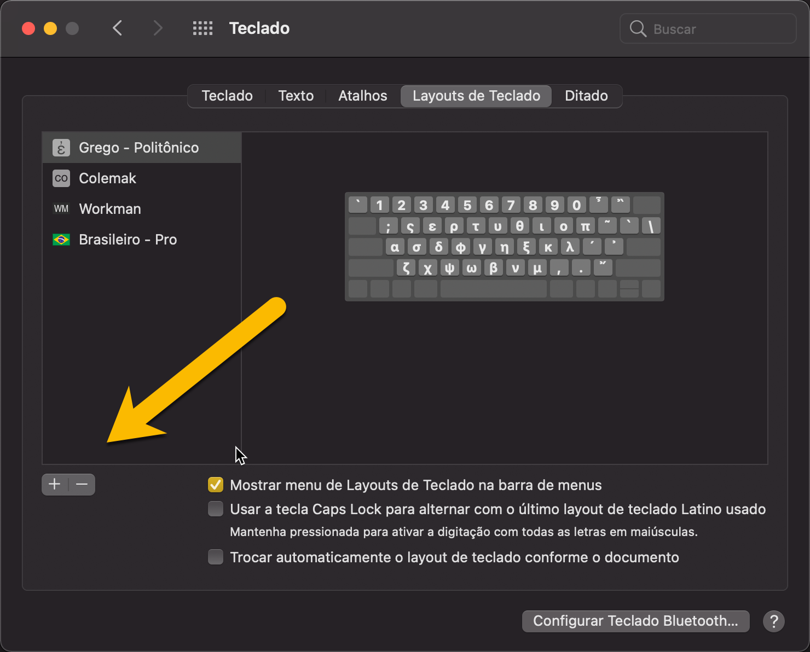
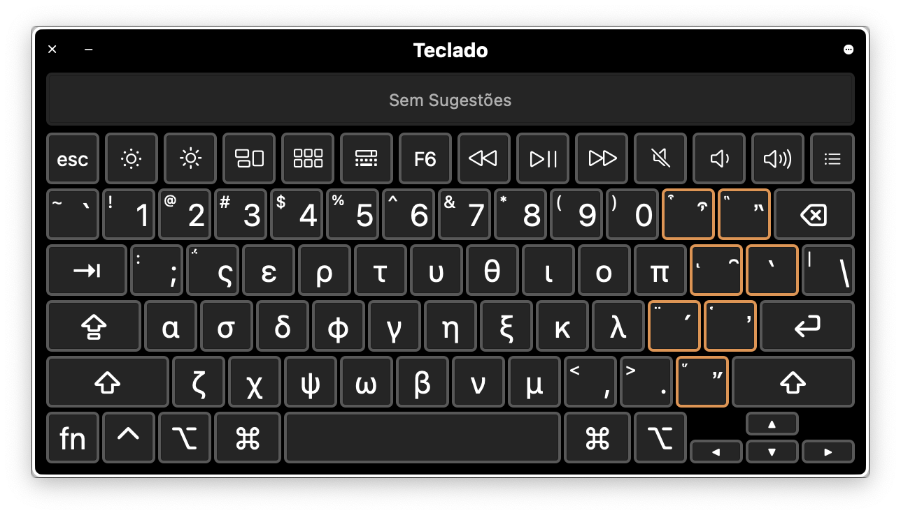
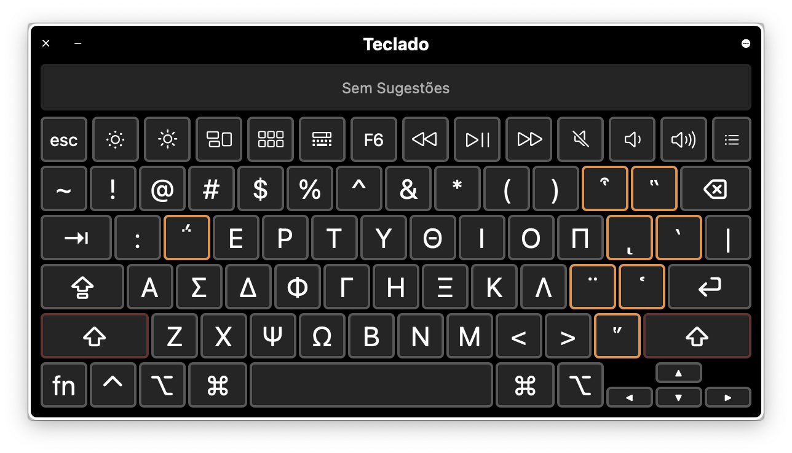

 #LayoutsdeTeclado
 
Para instalar o teclado grego no **macOS**, siga os seguintes passos.  

1. Abra as **Preferências do Sistema**.
2. Abra o item **Teclado**.
3. Navegue até a aba **Layouts de Teclado**.
4. Selecione a opção para adicionar um novo item.

  

- Daqui em diante, basta selecionar a língua grega e a opção do grego politônico.
- É uma boa ideia deixar a opção "**Mostrar menu de Layouts de Teclado na barra de menus**" marcada. Sempre que você precisar do grego politônico, basta trocar o teclado na barra de menus, no canto superior direito da tela.  

