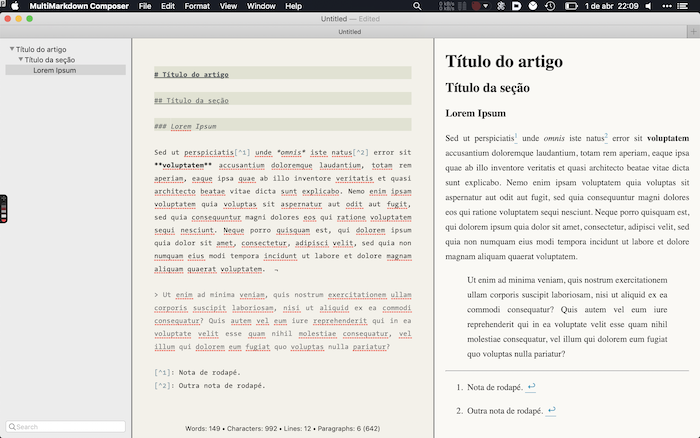

Markdown é uma linguagem minimalista [criada em 2004](https://daringfireball.net/projects/markdown/) por [John Gruber](https://en.wikipedia.org/wiki/John_Gruber) e [Aaron Swartz](http://www.aaronsw.com/weblog/001189) com o propósito de possibilitar a geração de texto *html* — i.e. *hypertext markup language*, a principal linguagem utilizada na internet — a partir de um texto legível e com poucas distrações. O que começou como uma linguagem de marcação, digamos, anêmica e voltada apenas para a internet, evoluiu para uma linguagem extremamente popular com um bom conjunto de funcionalidades, capaz de satisfazer todas as necessidades do mundo científico e acadêmico. Utilizando a ferramenta de conversão chamada [Pandoc](Pandoc.md), além disso, é possível transformar um texto em Markdown em praticamente qualquer outro formato existente, de um eBook a um livro acabado, passando por documentos em rtf, latex, docx ou html. É mais fácil obter um produto final com alta qualidade tipográfica utilizando Markdown do que qualquer outro processador de texto, como o Word.

Para os nossos fins, Markdown é extremamente relevante, pois é o meio mais simples de estruturar um texto de [fonte primária](https://gdct.blot.im/tagged/fontes-primárias) excessivamente longo, de registrar e manter anotações de pesquisa a longo prazo em um formato agnóstico ([pode ser lido por qualquer programa](markdown)) e que não demanda gastar tempo se ocupando da aparência do texto. É também a linguagem utilizada pela maioria das implementações digitais do [Zettelkasten](Zettelkasten.md). Ou seja, é uma linguagem que podemos utilizar na construção de uma [Wiki Pessoal](Wikis.md) de pesquisa.

## Parágrafos

Para terminar um parágrafo e introduzir uma quebra de linha, basta acrescentar dois espaços em branco e um retorno (enter). 

```markdown
Eis uma linha.  
Eis uma linha nova.
```

Se você acrescentar apenas um retorno, sem os dois espaços em branco no fim da linha, isso será interpretado apenas como **um** espaço em branco. É importante saber também que 2, 3 ou 10 espaços em branco serão sempre representados como apenas um espaço.


## Títulos de seções  

São marcados com `#`.  É sempre boa prática saltar uma linha depois do título de uma seção. 
Exemplo:  

```markdown
# Título  

## Subtítulo  

### Subsubtítulo  

#### Etc...  

```  

## Citações  

São indicadas pelo maior `>`.  
Exemplo:  

```markdown  
 > Lorem ipsum…  
```  

## Notas de rodapé  

Podem ser feitas de mais de um modo.  
Exemplo 1:  

```markdown  
Lorem ipsum[^texto da nota de rodapé].  
```  

Exemplo 2:  
```markdown    
Lorem ipsum[^1].  
Etc.  

[^1]: Texto da nota de rodapé.  
```  

## Ênfase  

Pode variar, mas no geral é feita com um único asterisco antes e depois para *itálico* e dois asteriscos para **negrito**.  Exemplo:  

```markdown    
*Texto em itálico* e **texto em negrito**.  
```  

## Listas  
A lista ordenada é indicada por um número `1.` e a lista não ordenada pelo asterisco.  

```markdown    
1. Item 1  
1. Item 2  

- item  
- item  
```  

  

Há bastante material na internet sobre markdown e seus diferentes sub-tipos, mas tudo que você precisa saber está nesse resuminho aí em cima. 

