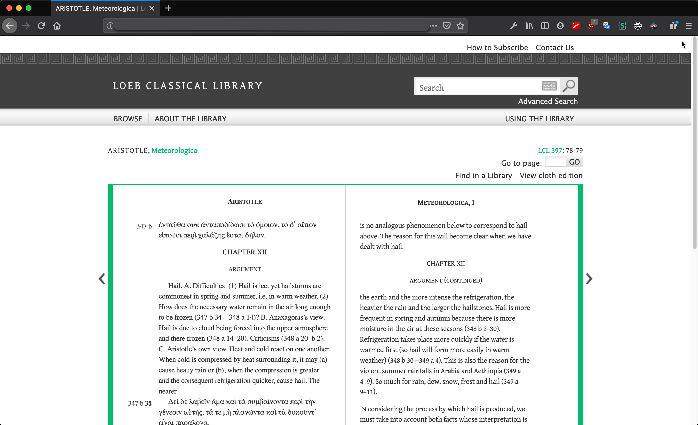
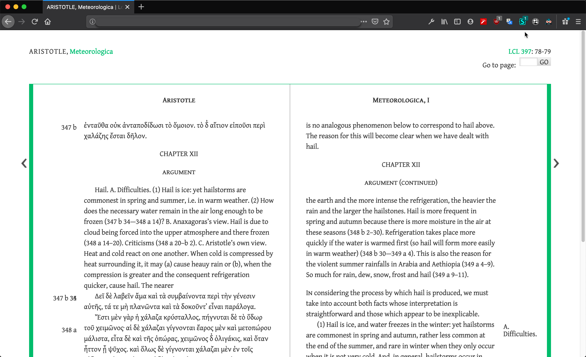

Se você usa o site da LOEB Classical Library, sobretudo offline, eis algumas alterações que podem tornar a experiência de ler, navegar e consultar os textos um pouco mais agradável. Para adicioná-las ao site, basta usar extensões para o navegador como o Stylus ou o Cascadea.

```css

/* Remover o header com a logo, How to Subscribe, Contact Us, etc. */
#headerWrap{
display:none!important;
}

/* Remover 'find in library' e 'view cloth edition' */
li.buyPrint,
li.worldCat{
	display:none!important;
}

/* Remove o rodapé da Harvard Uni Press */
#footerWrap{
display:none!important;
}

/* Remove a toolbar com ferramentas de anotação que não funcionam no modo offline */
#contentToolbar,
#contentToolbox{
display:none!important;
}

/* Aproveitando melhor o espaço da tela para exibir o livro */
#pageBody {
	width:90%!important;
}

/* Mudanças na fonte */
*{
  font-family: Gentium Plus!important;  
  font-size: 18px!important;  
}

```

## Antes



## Depois

