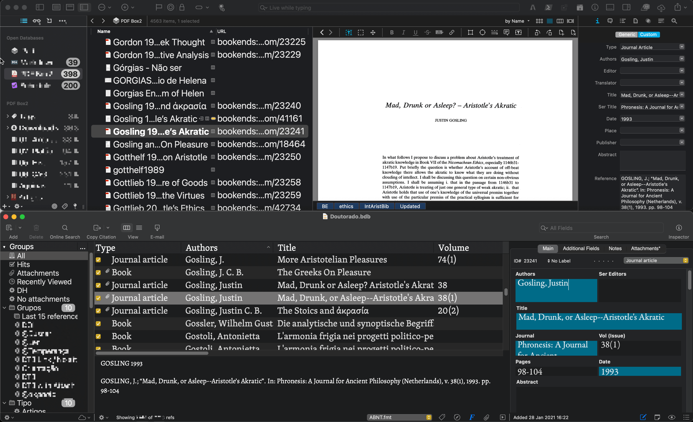

Script para sincronizar os metadados de uma entrada bibliográfica do Bookends com os metadados de um item do DEVONthink 3. O objetivo do script é ajudar a manter arquivos PDF guardados no DT3 em harmonia e conectados com as referências bibliográficas do Bookends. 

Antes de utilizar, leia com cuidado. Entenda que modificações feitas por scripts não podem ser facilmente desfeitas (você precisa ter um backup, pois não é possível simplesmente desfazer a ação). Provavelmente você terá que fazer adaptações para que ele funcione de acordo com as suas necessidades.

Obs.: Há um comando no script para renomear o arquivo anexo utilizando o campo *short title* do BE ou um filtro específico[^1] que eu criei com o seguinte padrão: SOBRENOME ANO TÍTULO. *E.g.* **Long 2004 Ethics of Ontology** ou **Landor 1935 Aristotle on demonstrating essence**. No caso das traduções dos textos antigos, utilizo o padrão ABREVIAÇÃO ANO TRADUTOR, *e.g.* ***Cael* 2020 Reeve** ou ***EN* 2012 Sachs**.

```applescript

use AppleScript version "2.4" -- Yosemite (10.10) or later
use scripting additions

property Method : "UUID" -- UUID, Selection, Search_Filename, Search_Title
property theGroupUUID : "" -- To use with the search options: are the files in a specific group?
-- BCDAVASCONCELOS 2021-02-04-23-09


tell application "Bookends"
	tell front library window
		set theRefs to selected publication items
		set theRefsNo to count of theRefs
		
		repeat with theRef in theRefs
			--		set theRef to first item of theRefs
			
			if theRef is {} then error -- Error messages	
			
			-- Get properties of selected reference
			set theType to type of theRef as text
			set theID to id of theRef
			set theAbstract to abstract of theRef
			set theAuthors to authors of theRef
			set theEditor to editors of theRef
			set theTitle to title of theRef
			set theAbstract to abstract of theRef
			set thePublisher to publisher of theRef
			set theLocation to location of theRef
			set theVolume to volume of theRef
			set theKeywords to keyword names of theRef
			set theKeywords2 to keywords of theRef
			set theDate2 to publication date string of theRef
			set theURL2 to url of theRef
			set theISBN to isbn of theRef
			set theDOI to doi of theRef
			set theTranslator to user3 of theRef
			set theBibkey to user1 of theRef
			set thePages to pages of theRef
			set theIssue to volume of theRef
			set theNotes to notes of theRef
			set theLanguage to language of theRef
			set theAttachments to attachments of theRef
			set theJournal to journal of theRef
			set theShortTitle to short title of theRef
			set theFormattedReference to format theRef using "ABNT.fmt"
			set theShortTitle to format theRef using "Rename.fmt"
			set theNameRec to theAuthors & " " & theDate2 & " " & theTitle
			
			
			tell application id "DNtp"
				
				if Method is "Selection" then
					try
						set theRecords to the selection
						set theRecord to item 1 of theRecords
					end try
					if theRecord is {} then set GoAhead to false
					if theRecord is {} then set GoAhead to true
					
				else if Method is "UUID" then
					set theRecord to ""
					set theUUID to theURL2
					set theUUID to my replaceText(theUUID, "x-devonthink-item://", "")
					try
						set theRecord to get record with uuid theUUID
					end try
					if theRecord is missing value then set GoAhead to false
					if theRecord is not missing value then set GoAhead to true
					
					
				else if Method is "Search_Title" then
					try
						set theRecords to ""
						set theRecord to ""
						set theGroup to get record with uuid theGroupUUID
						set theSearch to "name:" & theTitle
						set theRecords to search theSearch in theGroup
						set theRecord to item 1 of theRecords
					end try
					if theRecord is "" then set GoAhead to false
					if theRecord is not "" then set GoAhead to true
					
					
				else if Method is "Search_Filename" then
					try
						set theRecords to ""
						set theRecord to ""
						--		set theGroup to get record with uuid theGroupUUID
						set theRecords to search "filename:" & theAttachments
						set theRecord to item 1 of theRecords
					end try
					if theRecord is "" then set GoAhead to false
					if theRecord is not "" then set GoAhead to true
				end if
				
				
				if GoAhead is true then
					
					
					set theUUID to the uuid of theRecord
					set the aliases of theRecord to theBibkey
					set the URL of theRecord to ("bookends://sonnysoftware.com/" & theID) as text
					set theDTURL to reference URL of theRecord
					
					if theShortTitle is not "" then set the name of theRecord to theShortTitle
					if theShortTitle is "" then set theShortTitle to the name of theRecord
					
					set theDTTags to tags of theRecord
					set the tags of theRecord to theDTTags & space & theKeywords & space & "Updated"
					
					set theDTTags to tags of theRecord
					set theKWs to ""
					
					repeat with theTag in theDTTags
						set theKWs to theKWs & theTag & linefeed
					end repeat
					
					set theKWs to my trimtext(theKWs, linefeed, "end")
					set theFile to filename of theRecord
					
					
					
					-- add custom meta data ("bookends://sonnysoftware.com/" & theID) for "link" to theRecord
					add custom meta data theAuthors for "authors" to theRecord
					add custom meta data theEditor for "editor" to theRecord
					add custom meta data theTranslator for "translator" to theRecord
					add custom meta data theTitle for "title" to theRecord
					add custom meta data thePublisher for "publisher" to theRecord
					add custom meta data theLocation for "place" to theRecord
					add custom meta data theVolume for "volume" to theRecord
					add custom meta data theDate2 for "date" to theRecord
					add custom meta data thePages for "page" to theRecord
					add custom meta data theAbstract for "abstract" to theRecord
					add custom meta data theBibkey for "bibkey" to theRecord
					add custom meta data theDOI for "doi" to theRecord
					add custom meta data theISBN for "is?n" to theRecord
					add custom meta data theJournal for "sertitle" to theRecord
					add custom meta data theJournal for "journal" to theRecord
					add custom meta data theIssue for "issue" to theRecord
					add custom meta data theNotes for "notas" to theRecord
					add custom meta data theFormattedReference for "Reference" to theRecord
					
					if theType is "1" then set theType to "Artwork"
					if theType is "2" then set theType to "Book"
					if theType is "3" then set theType to "Book Chapter"
					if theType is "4" then set theType to "Conference Proceedings"
					if theType is "5" then set theType to "Dissertation"
					if theType is "6" then set theType to "Edited Book"
					if theType is "7" then set theType to "Editorial"
					if theType is "8" then set theType to "In Press"
					if theType is "9" then set theType to "Journal Article"
					if theType is "10" then set theType to "Letter"
					if theType is "11" then set theType to "Map"
					if theType is "12" then set theType to "Newspaper Article"
					if theType is "13" then set theType to "Patent"
					if theType is "14" then set theType to "Personal communication"
					if theType is "15" then set theType to "Review"
					if theType is "16" then set theType to "Internet"
					add custom meta data theType for "Type" to theRecord
					
					
					
					-- Set URL to DEVONThink in Bookends
					tell application "Bookends"
						tell front library window
							set url of publication item id theID to theDTURL
							set the keywords of theRef to (theKWs as text)
							set attachments of theRef to theFile
							set short title of theRef to theShortTitle
						end tell
					end tell


				end if
				
				if theRecord is missing value then
					tell application "Bookends"
						tell front library window
							set theKeywords to keywords of theRef
							set keywords of theRef to theKeywords & linefeed & "Missing value"
						end tell
					end tell
				end if
				
				
			end tell
		end repeat
	end tell
end tell


on replaceText(theString, old, new)
	set {TID, text item delimiters} to {text item delimiters, old}
	set theStringItems to text items of theString
	set text item delimiters to new
	set theString to theStringItems as text
	set text item delimiters to TID
	return theString
end replaceText


on trimtext(theText, theCharactersToTrim, theTrimDirection)
	set theTrimLength to length of theCharactersToTrim
	if theTrimDirection is in {"beginning", "both"} then
		repeat while theText begins with theCharactersToTrim
			try
				set theText to characters (theTrimLength + 1) thru -1 of theText as string
			on error
				-- text contains nothing but trim characters
				return ""
			end try
		end repeat
	end if
	if theTrimDirection is in {"end", "both"} then
		repeat while theText ends with theCharactersToTrim
			try
				set theText to characters 1 thru -(theTrimLength + 1) of theText as string
			on error
				-- text contains nothing but trim characters
				return ""
			end try
		end repeat
	end if
	return theText
end trimtext


```

[^1]: O filtro é extremamente simples de fazer. Se tiver dúvidas, consulte o manual do Bookends (**HELP > USER GUIDE**) ou [entre em contato](mailto:bernardovasconcelos@gmail.com).