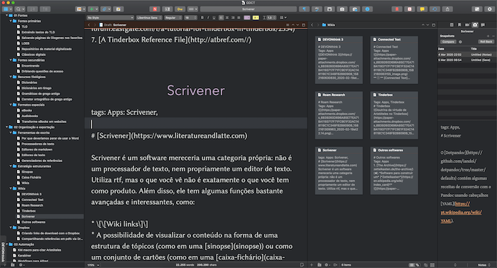

  
   
O [Scrivener](https://www.literatureandlatte.com) é um software mereceria uma categoria própria: ele não é apenas um editor de texto plano, mas tampouco é um processador de texto convencional. Ele usa [rtf](https://pt.wikipedia.org/wiki/Rich_Text_Format), mas o que você vê não é o que você obtém como resultado. Além disso, ele tem ferramentas como...
 
- \[\[Wiki links\]\]  
- Um encadernador (*binder*) para... 
	- mover/organizar o conteúdo; 
	- limitar a visualização a algumas seções, pastas, coleções ou arquivos;
- Visualização do conteúdo na forma de uma estrutura de tópicos (como em uma [Sinopse](Sinopse.md)).
- Visualização do conteúdo como um conjunto de cartões (como em uma [caixa-fichário](Zettelkasten.md)).
- Metadados customizados e/ou palavras chave em toda e qualquer seção do texto.
- Snapshots que permitem comparar o texto atual com versões antigas e restaurá-las quando preciso.  
  
Essas são apenas algumas das funções que o Scrivener oferece. Ele é de longe o processador/editor de texto mais completo para macOS e Windows, especialmente para a redação de documentos longos. Recomendo [conferir a documentação](https://www.literatureandlatte.com/learn-and-support/user-guides).  

## Download
[MacOS](https://www.literatureandlatte.com/download_action.php?url=https://scrivener.s3.amazonaws.com/Scrivener.dmg), [Windows-64](https://www.literatureandlatte.com/scrivenerforwindows/beta/Scrivener-29916-installer_x64.exe), [Windows-32](https://www.literatureandlatte.com/scrivenerforwindows/beta/Scrivener-29916-installer_x86.exe)

Se o link para a versão do Windows não funcionar, você encontrará [nessa página](https://www.literatureandlatte.com/forum/viewtopic.php?f=57&t=40621) o link para o download da versão mais recente.

## Referências úteis  

- Para automatizar o uso do Scrivener 3 com o Pandoc, recomendo conferir o [Scrivomatic](https://github.com/iandol/scrivomatic). Esse método exige um pouco de conhecimento técnico para instalar todas as dependências, mas o link oferecido contém instruções detalhadas.
- O [Dotpandoc](https://github.com/iandol/dotpandoc/tree/master/defaults) contém algumas receitas de conversão com o Pandoc usando cabeçalhos [YAML](https://pt.wikipedia.org/wiki/YAML).

