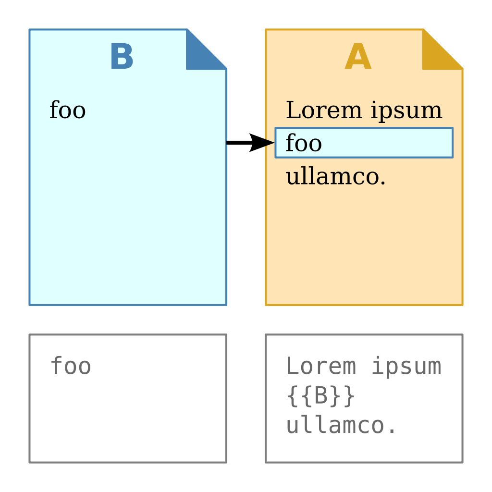

Grosso modo, é uma forma de transpor o conteúdo de um documento para dentro de outro documento.

Exemplo: suponhamos que eu tenha um documento chamado `Texto 1`, que é meu texto principal, e outro secundário que contém apenas uma citação, chamado `Citação 1`.

Se dentro do meu texto principal eu incluir uma chamada pelo arquivo secundário (geralmente feita com duplas chaves), então eu terei um produto final que inclui o seu conteúdo.

Fonte da imagem: [Wikipedia](https://en.wikipedia.org/wiki/Transclusion)
