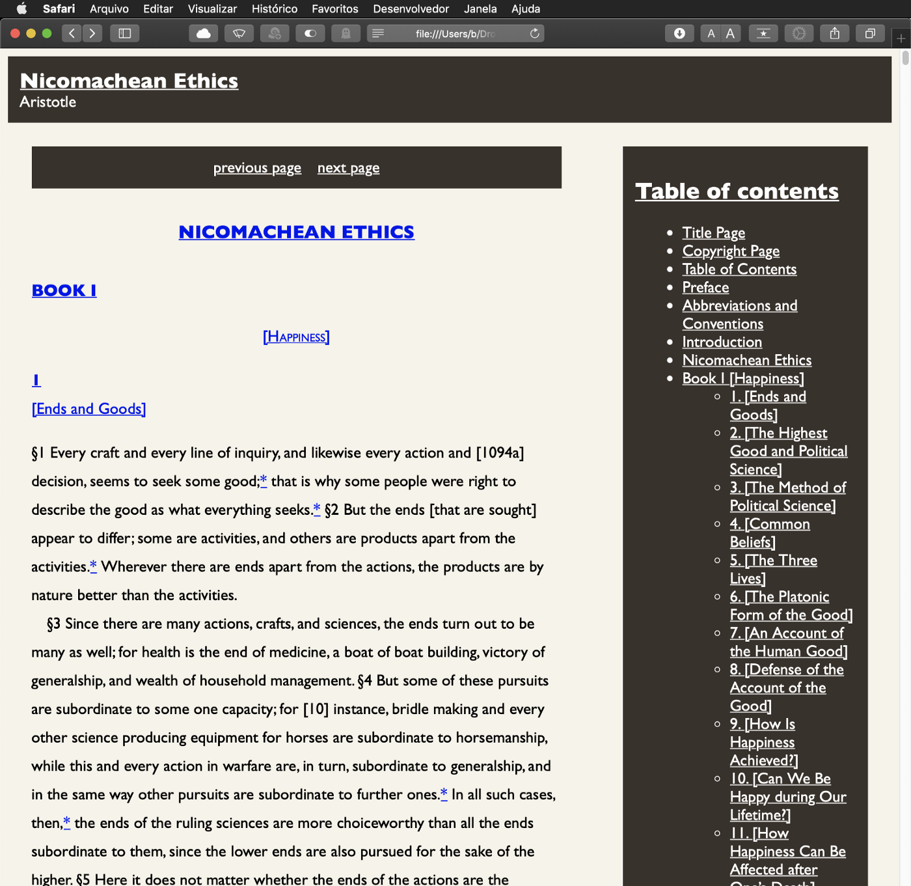

Eis um bom conselho para você que precisa fazer um uso intenso de eBooks para fins de pesquisa acadêmica: que tal convertê-los em páginas html que podem ser navegadas no seu browser e copiadas livremente sem restrições?  

Eis como fazê-lo:  

1. Instale o [Kindle 1.17.1](https://www.epubsoft.com/soft/kindle-for-pc.html) para PC/MAC/Linux. **Sim, precisa ser essa versão.** De outra forma você não conseguirá remover o DRM do arquivo.  
2. Instale o [Calibre](https://calibre-ebook.com/) e adicione o plug-in [DeDRM](https://github.com/apprenticeharper/DeDRM_tools/releases). Procure a opção *Adicionar Plug-in a partir de arquivo*.  
3. Baixe seus eBooks no Kindle para PC/MAC/Linux e abra os arquivos no Calibre. Para encontrar a pasta de eBooks, entre em *Preferências* e busque a *Pasta de Conteúdo*.  
4. Finalmente, converta o ebook importado em um arquivo *zip* e faça a extração do conteúdo para uma pasta.  
5. Voilà  

  
