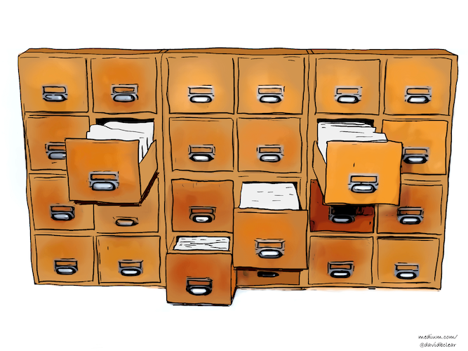
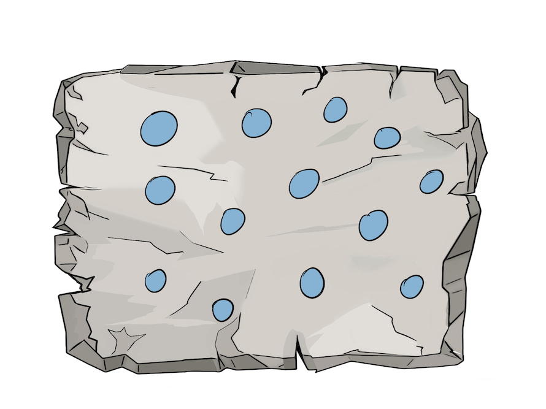
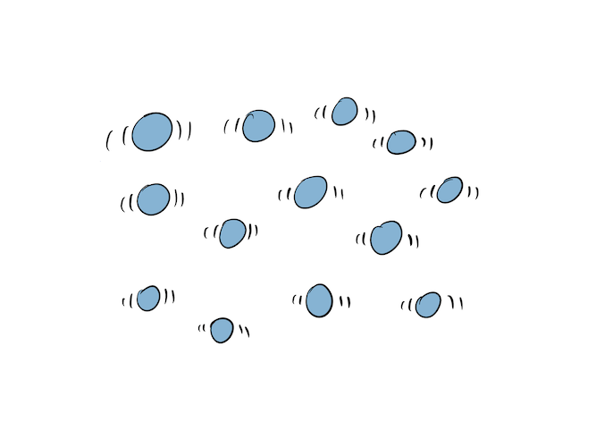
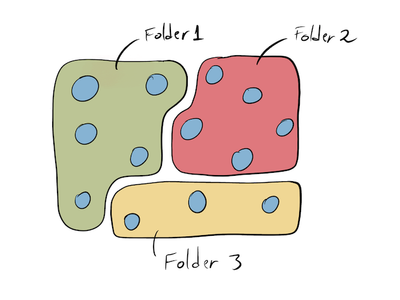
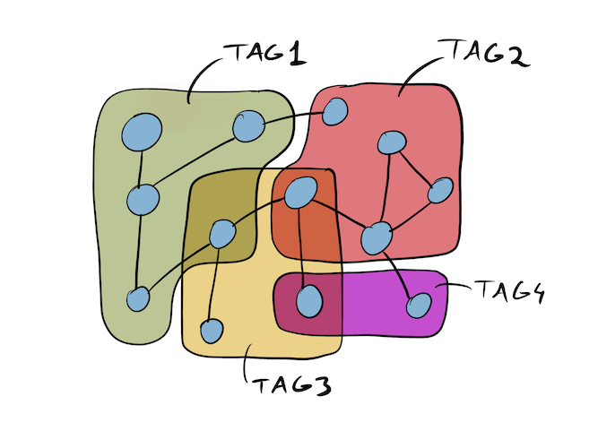
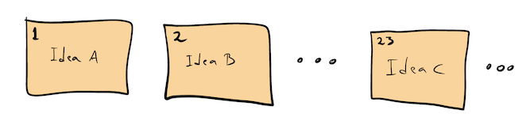
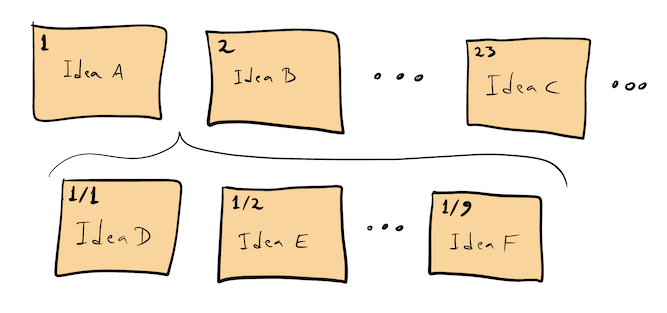
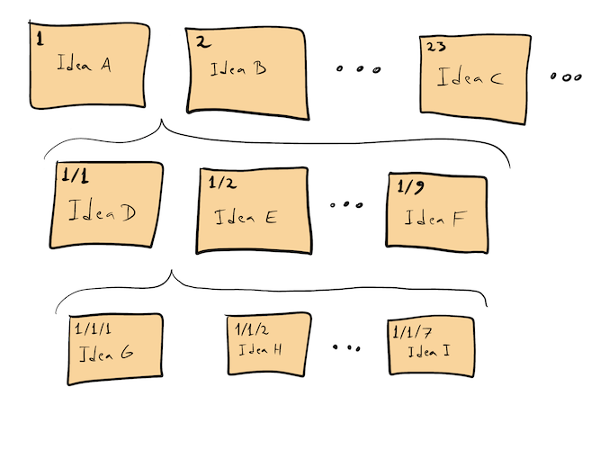
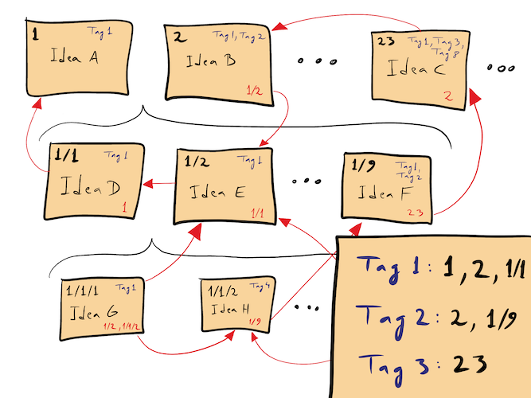

 #Organização, #Apps
*a.k.a. Zettelkasten*  

*Atualizado em 2020-04-13-21-45-47*

A expressão "Caixa fichário" é uma tradução de *Zettelkasten*. Literalmente, ela significa apenas uma caixa onde são guardadas fichas. Esse é também o nome de um método de trabalho desenvolvido pelo sociólogo Niklas Luhmann e que hoje é mais conhecido e utilizado no meio acadêmico de língua alemã. Apesar de soar como um método de organização ou armazenamento, esse certamente não é o caso. Antes de mais nada, a caixa-fichário é uma interlocutora em um diálogo. Mas como esse diálogo é construído?

Normalmente as *teses* e ideias que encontramos na bibliografia secundária, e mesmo em nossas anotações, se encontram condensadas e articuladas em um texto ou fio argumentativo. Para criar novas associações e forjar novas relações entre conceitos, o primeiro passo é praticar a **divisão**.

Com as ideias atomizadas em fichas, e removidas do seu contexto de origem, há uma ampla margem para a construção de diferentes formas de vinculação com outras ideias. Dizendo de outro modo, podemos praticar a **reunião** de diferentes modos: alguns diretos outros indiretos.  

Um primeiro modo possível, e indireto, ao qual estamos acostumados, é por meio do uso de pastas. Nesse modelo, baseado na experiência concreta de organização em arquivos, cada ficha pertence a uma única caixa (ou sequência, como veremos). É um modo muito útil e tradicional de manter as coisas organizadas.

Um segundo modo possível de associação, também indireto, desconsidera a limitação física e torna possível que uma ficha participe de mais de um agrupamento. Isso é feito por meio de etiquetas, `#tags`, que podem formar diversos grupos sobrepostos para servir a diferentes propósitos.

Um terceiro modo, por fim, são os **links diretos** entre ideias dentro do nosso sistema. Novamente, aqui não há limites para o número de ligações possíveis entre as fichas.

Mas é claro que para que essas ligações sejam possíveis, é preciso que haja um sistema de endereçamento das fichas que torne possível referencia-las e incluí-las em diferentes etiquetas ou ligações diretas. Dizendo de outro modo, tudo dentro do sistema precisa de um endereço fixo que não sofrerá nenhum tipo de alteração com o decorrer do tempo de modo a não romper qualquer ligação existente.

## Pastas, etiquetas e links na caixa fichário

Nesse método de trabalho baseado em anotações em fichas concretas, como era o caso do *Zettelkasten* do Luhmann, a solução consiste em numerar as notas à medida em que são adicionadas à caixa fichário.

Sempre que possível, uma nota será incluída atrás de uma outra nota existente com a qual dialogue. Se já houver uma outra nota atrás que continue a sequência, sem problemas, ela pode ser adicionada como um subitem na numeração (`1, 2, 2a, 3, 4, 4a, 4b, 5`). Quando não for possível, por ela não dialogar com nenhuma outra nota existente, ela entra no fim da sequência.

Há dois detalhes relevantes sobre esse modo de organização.

1. Ele baseia-se no modelo de ligação indireto das pastas, já que uma nota essencialmente serve como pasta (ou início da sequência de subitens) para as demais.

2. Com a possibilidade de desdobrar cada item existente, é como se pudéssemos manter diversos diálogos em paralelo. Cada ficha será sempre o início de um fio que pode se desdobrar indefinidamente.

Os dois outros modos de associação entre fichas descritos anteriormente aparecem no sistema do seguinte modo:

1. Etiquetas são atribuídas às fichas anotando-as na própria ficha e registrando em uma ficha adicional o endereço de todas as fichas com aquela etiqueta.

2. Ligações diretas são, similarmente, anotadas no corpo de cada ficha. Eventualmente uma nova ficha pode ser necessária para justificar, esclarecer ou desdobrar a razão daquele link direto.

## Dialogando

Pela descrição e pelas imagens, fica claro como o método da caixa fichário serve para criar novas redes neurais com um aspecto profundamente orgânico: os fios são potencialmente infindáveis e de tamanhos variados. Certos agrupamentos são coesos, outros caóticos e para várias fichas talvez ainda não haja mais de um agrupamento possível. Todas essas característica são, na visão de Luhmann, elementos da individualidade da nossa caixa fichário como parceira de conversa. Não há uma simples aplicação de critérios e categorias exógenas para estruturar a caixa; ao invés, todo e qualquer princípio de organização deve emergir a partir das necessidades impostas pelo próprio conteúdo.

A esse respeito é importante observar que Luhmann nunca modificava a posição ou o endereço de uma ficha. Sempre que uma nova estrutura emergia do conteúdo, dando origem a novos critérios de organização ou ordenamento, ele produzia uma nova ficha indexando os endereços e registrando a racionalidade por trás daquela relação. A ideia por trás desse procedimento é a de que todas estruturas emergentes são temporárias e sujeitas a modificações, de modo que não faria sentido reorganizar todo o conteúdo da caixa fichário e permanecer sempre preso àquela estrutura. A organização em pastas é, portanto, uma forma de organização mais ou menos fixa (exceto pela possibilidade de adicionar novas fichas).

É com o passar dos anos, e depois da aquisição de uma massa crítica, que ela passa a ser verdadeiramente útil. Cada vez que buscarmos junto a ela elementos para explorar uma determinada questão, teremos assegurada uma possibilidade de um novo diálogo. À medida que o diálogo avança, novas perspectivas emergem e com elas novos princípios com capacidade de explicar e ordenar elementos previamente dispersos ou apenas indiretamente relacionados.

Sobre as opções para construir uma caixa fichário digital, veja a página sobre as [Wikis](Wikis.md).

# Sugestões de leitura  

- [Andy Matuschak's working notes](https://notes.andymatuschak.org/)
- [Create a Zettelkasten for your Notes to Improve Thinking and Writing](https://zettelkasten.de/posts/zettelkasten-improves-thinking-writing/)  
- [Communicating with Slip Boxes - An Empirical Account](http://luhmann.surge.sh/communicating-with-slip-boxes)  
- [Zettelkasten — How One German Scholar Was So Freakishly Productive](https://writingcooperative.com/zettelkasten-how-one-german-scholar-was-so-freakishly-productive-997e4e0ca125)  
- [The Zettelkasten Method](https://www.lesswrong.com/posts/NfdHG6oHBJ8Qxc26s/the-zettelkasten-method-1)  
- [How to take smart notes review](https://www.lesswrong.com/posts/T382CLwAjsy3fmecf/how-to-take-smart-notes-ahrens-2017)

# Créditos  

Todas as imagens são de autoria de [David B. Clear](https://writingcooperative.com/zettelkasten-how-one-german-scholar-was-so-freakishly-productive-997e4e0ca125).
